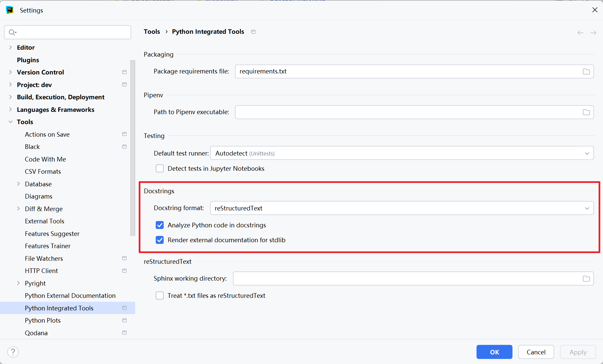
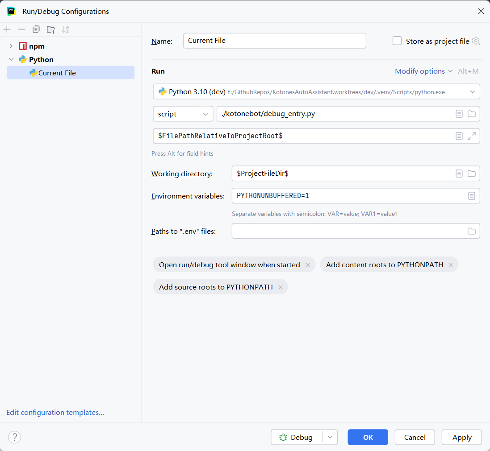

# 开发
## 共通
1. 安装 [just](https://github.com/casey/just#packages) 构建工具。
2. 创建 Python 3.10 虚拟环境，配置 node 环境。
3. 执行：
   ```bash
   git clone https://github.com/XcantloadX/kotones-auto-assistant.git
   cd kotones-auto-assistant
   just env
   cd kotonebot-devtool
   npm i
   ```

## VSCode
1. 进入“扩展 Extension”，搜索 `@recommended` ，然后安装里面的所有插件。
2. 打开 VSCode 设置，搜索 `python.analysis.supportRestructuredText` 并勾选。
3. 打开 VSCode 设置，搜索 `imageComments.pathMode` 并设置为 `relativeToWorkspace`。
4. 在 VSCode 中选择“Terminal” -> “Run Task” -> “Make R.py”并执行。

## PyCharm
1. 设置 Docstring 渲染


2. 按照下图新建一个 Run Configuration：


3. \[可选\] 强烈建议关闭 PyCharm 内置 typing check，安装
[Pyright for PyCharm](https://plugins.jetbrains.com/plugin/24145-pyright) 作为替代。
PyCharm 内置 typing check 功能太弱，在 kaa 代码中经常出现错误推断。
如果你倾向于使用 mypy，也可以安装 [Mypy](https://plugins.jetbrains.com/plugin/25888-mypy) 插件。

4. \[可选\] 启动 `tools\image_server.py`。
由于 [PyCharm 的 bug](https://youtrack.jetbrains.com/issue/PY-54150/Cannot-display-local-images-in-docstring)， 
docstring 中无法渲染本地图片，所以必须启动一个 HTTP 服务器作为中转。
如果你不需要预览 docstring 中的图片（特别是 `R.py` 中的图片），可以跳过此步骤。

5. **从 PyCharm 内置终端**执行 `tools\make_resources.py`。
如果从外部终端执行，需要指定参数 `-i pycharm`。

## 运行单个任务
VSCode：运行配置里选择 `Python: Current Module`。

PyCharm：使用刚刚创建的 Run Configuration。

## 打包 & 安装
```bash
just package
pip install --find-links=dist ksaa
```

## 截图
建议使用 [XnView MP](https://www.xnview.com/en/xnviewmp/) 进行截图裁剪工作。

XnView MP 可以方便的完成“打开图片 → 选区 → 裁剪图片 → 另存选取为文件”这一操作。
只需要提前设置好右键菜单：


## 备注
1. 所有 Python 脚本（包括 kaa 主体、tools 下脚本等）均需要以项目根目录为工作目录执行