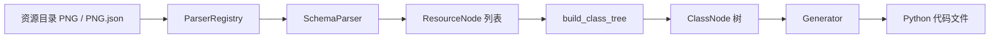

# 资源生成架构

本文解释当前 `kotonebot.devtools.resgen` 的整体架构、数据流、扩展点与设计取舍。

## 1. 架构目标

`resgen` 的目标是把“资源文件 + 元信息”稳定转换为可引用的 Python 代码，同时保留可扩展性。

主要目标：

- 解析层和生成层解耦。
- IR（中间表示）稳定，可复用。
- 下游可在不修改主干代码的前提下定制输出。

## 2. 模块分层

从职责上可以拆成四层：

- 输入层：扫描文件、加载配置、构建运行上下文。
- 解析层：不同 `SchemaParser` 负责把文件转成 `ResourceNode`。
- 组织层：`build_class_tree` 把扁平资源组织成 `ClassNode` 树。
- 输出层：`StandardGenerator` / `EntityGenerator` 渲染代码。

## 3. 主数据流

## 4. 核心组件

### 4.1 解析器注册表（ParserRegistry）

- 负责管理解析器实例。
- 对每个文件按注册顺序找到可处理的解析器。

### 4.2 IR：ResourceNode 与 ClassNode

- `ResourceNode`：描述单个资源条目（类型、值、元数据、注释）。
- `ClassNode`：用于构造层级类结构。

IR 的价值是稳定边界：解析器输出和生成器输入都围绕 IR 协作。

### 4.3 生成器（StandardGenerator / EntityGenerator）

- `StandardGenerator`：通用资源索引输出。
- `EntityGenerator`：偏 prefab/实体表达的输出风格。

两者共享基础渲染逻辑，并在各自层面扩展特定能力。

### 4.4 扩展机制（RendererRegistry + Policy）

当前生成器支持三类可插拔扩展：

- `RendererRegistry`：注册/覆盖资源 renderer，用于替换某类资源输出。
- `PathPolicy`：统一控制路径表达式生成策略。
- `DocstringPolicy`：统一控制 docstring 渲染策略。

职责划分：

- Renderer：决定“输出结构”。
- Policy：决定“输出规则”。

## 5. runner 作为编排层

`generate_resources` 负责：

- 扫描文件。
- 加载配置并构建 parser context。
- 执行解析并聚合 diagnostics。
- 构建类树并调用 `generator_factory` 生成代码。

它是推荐的项目级入口，也是最适合接入 CI 的位置。

## 6. 典型扩展路径

### 6.1 新增输入格式

- 新增 `SchemaParser` 实现。
- 注册到 `ParserRegistry`。

### 6.2 不改结构只改风格

- 使用 `PathPolicy`、`DocstringPolicy`。

### 6.3 只重写局部资源输出

- 注册自定义 renderer 到 `RendererRegistry`。

### 6.4 完全自定义输出

- 继承生成器并重写类渲染流程。

## 7. 设计取舍

当前实现优先考虑：

- 与既有 API 兼容。
- 常见扩展场景的低成本接入。

仍然保留的权衡：

- 生成器仍以 Python 输出为核心。
- 更复杂的模板化输出（例如跨语言后端）需要进一步抽象。